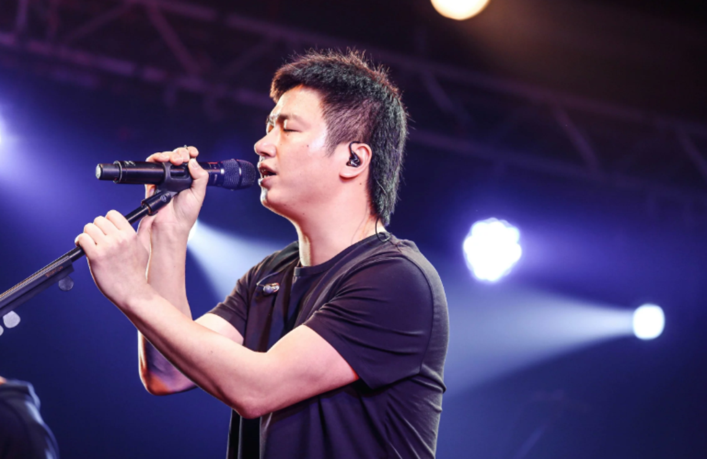

# 南京李志
## Dropbox 资源链接
链接：https://www.dropbox.com/sh/9a8jvyo5ostixv0/AAB5AGLKgimSH_zUFfGcPFGYa?dl=0
- 《8》
- i/O 2014-2015跨年现场
- 李志、电声与管弦乐 I 2016-2017跨年现场
- 李志、电声与管弦乐 II 2017-2018跨年现场
- 爵士乐与不插电新编 2017-2018跨年现场

## Google Drive 资源链接
链接：https://drive.google.com/drive/folders/12dlZFZtWoJ2ROYjo5J0Y44W_3BxkYNY1
- imagine 2011 live
- 108 个关键词 2012 live
- 北京不插电现场
- 动静 2015 live
- 工体东路没有人 2009 live
- 勾三搭四
- 看见 2015 live
- 李志1701

链接: https://drive.google.com/drive/folders/12i6u7v8zBrbPX70027dZ5b77SefPG6ka
- 1701
- 动静
- 工体东路没有人
- 勾三搭四
- 爵士与不插电新编12首
- 看见2015 Live
- 李志-电声与管弦乐
- 李志-电声与管弦乐II
- 李志北京不插电现场
- 我爱南京
- 这个世界会好吗
- i-O(2014 Live)
- MP3版 爵士乐与不插电新编12首
- MP3版李志-电声与管弦乐II

## 百度网盘资源链接
链接:https://pan.baidu.com/s/1D1L6eekzGkjhBLrJHMJwUQ 密码:xng0
### 无损：
- 1.2016 unplugged
- 2.勾三搭四
- 3.爵士与不插电新编12首
- 4.《8》
- 5.动静
- 6.电声与管弦乐
- 7.电声与管弦乐II
- 8.《1701》
- 9.你好，郑州
- 10.我爱南京
- 11.在每一条伤心的应天大街上
### MP3:
- 1.[IO2014]
- 2.108 个关键词 2012 Live
- 3.被禁忌的游戏
- 4.梵高先生
- 5.工体东路没有人 2009 Live
- 6.这个世界会好吗
- 7.《F》
- 8.Imagine 2011 Live

### 其他：
- 1.限量未发售非官方
- 2.洋自剪与09我爱南京

## Onedrive 资源链接
链接：https://1drv.ms/f/s!Ak5XTBnhGoz1gbFXgj62eTeDB2Mg0w
- 这个世界会好吗
- 8
- 108个关键词
- 1701独立发行
- F独立发行
- HSA MAN A FUTURE
- i O 2014Live
- Imagine 2012 Live
- 二零零九年十月十六日事件
- 你好郑州
- 动静2015 Live
- 勾三搭四 2
- 在每一条伤心的应天大街上
- 工体东路没有人 2009 Live
- 我爱南京(独立发行)
- 李志北京不插电现场2016 Live
- 梵高先生
- 爵士乐与不插电新编12首
- 电声与管弦乐2017
- 看见 2015 Live
- 被禁忌的游戏

链接: https://onedrive.live.com/?authkey=%21ALDItzddrS-dcqc&id=AA960D442CCB0C64%21115189&cid=AA960D442CCB0C64
- MV
- i O(2014 Live)
- 勾三搭四(2013 Live)
- 洗心革面.live.224k
- 勾三搭四.live.320k
- 看见北京.live.192k
- 看见西安.live.192k
- 看见重庆.live.320k
- 动静2015 Live
- 相信未来.live.flac
- 李志北京不插电现场
- F
- 在每一条伤心的应天大街上
- 李志 电声与管弦乐
- 看见
- 工体东路没有人
- 108个关键词(2012
- 8
- 其他单曲
- 1701
- 被禁忌的游戏
- 梵高先生
- 这个世界会好吗
- 我爱南京
- 你好郑州
- 二零零九年十月十六日

## 334的一些纪录片地址
- https://m.weibo.cn/status/4242848318702096

